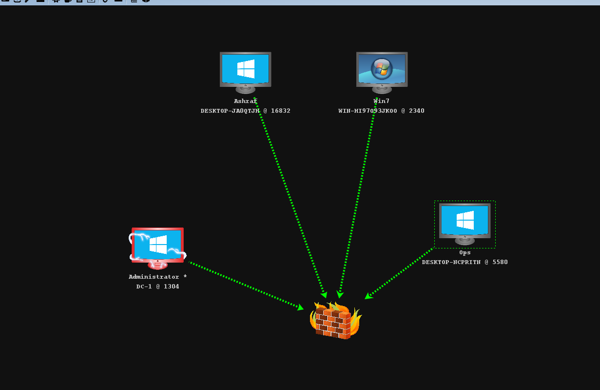

<h1 align="center">
DynamicSyscalls
</h1>


DynamicSyscalls is a library written in .net resolves the syscalls dynamically (Has nothing to do with hooking/unhooking) 
 
### Tested operating systems 
- Windows 11 22H2
- Windows 10 Build 22H2
- Windows server 2019 Build 1089
- Windows 7 service pack 1

### Code Examples
* [ProcessHollowing](Examples/ProcessHollowing)
* [ProcessInjection](Examples/ProcessInjection)
* [ProcessInjection2](Examples/ProcessInjection2)


### Calling NtCreateUserProcess Example
```csharp
using DynamicSyscalls;

// a94d1155ccc099603a91660f7d100c9f is the MD5 of NtCreateUserProcess
var CreateUserProcess = DynamicInvoke.GetDelegate<Native.NtCreateUserProcess>("a94d1155ccc099603a91660f7d100c9f", true);
// OR
var CreateUserProcess = DynamicInvoke.GetDelegate<Native.NtCreateUserProcess>("NtCreateUserProcess", false);

// Calling NtCreateUserProcess
uint NtCreateSuccess = CreateUserProcess(ref ProcessHandle, ref ThreadHandle, Native.PROCESS_ALL_ACCESS, Native.THREAD_ALL_ACCESS, IntPtr.Zero, IntPtr.Zero, 0, Native.THREAD_CREATE_FLAGS_CREATE_SUSPENDED, pProcessParams, ref info, ref attributeList);
if (NtCreateSuccess != 0)
{
    Console.WriteLine("NtCreateUserProcess Failed");
    return;
}

```

<h1 align="center">
<br>
</h1>
